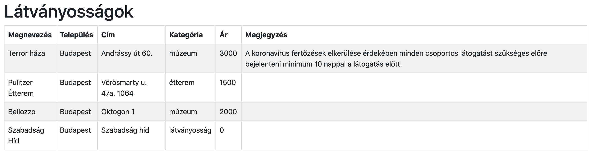
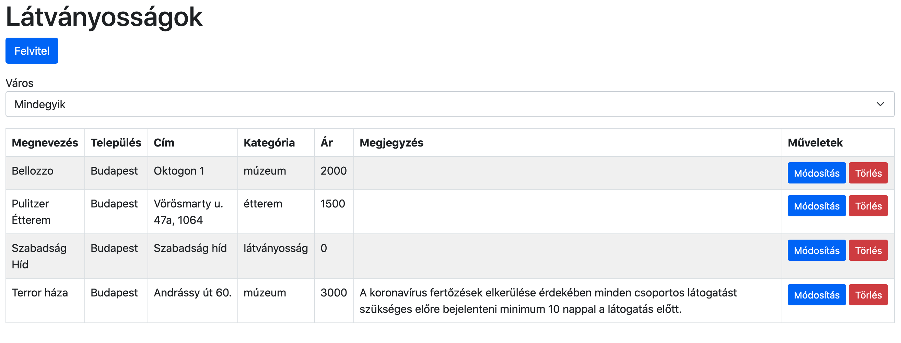
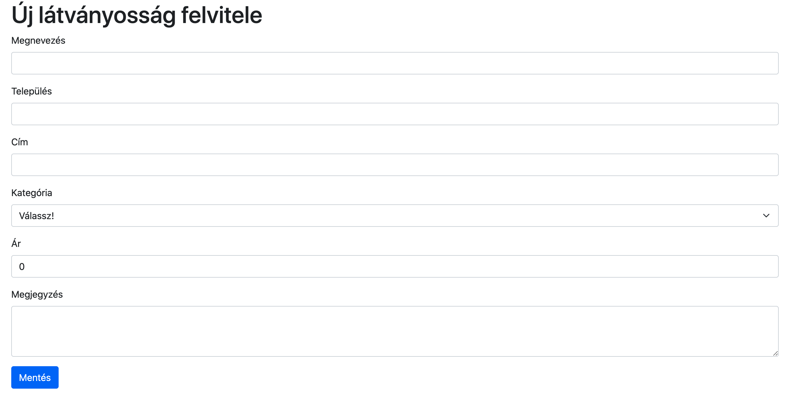
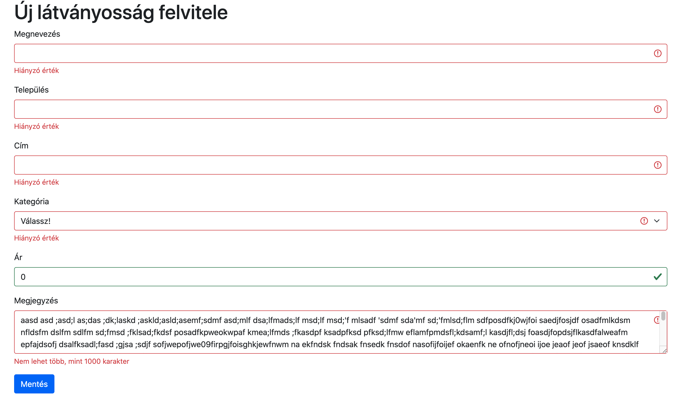
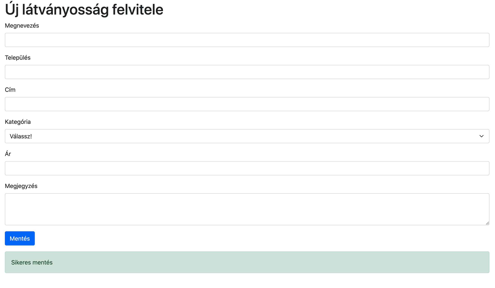

# HSG JS záróvizsga

## Kezdeti lépések

- Fork-old ezt a repository-t a saját account-odra
- Klónozd a fork-olt repository-t a saját számítógépedre
- Készíts egy `.gitignore` file-t, hogy a generált file-ok ne szerepeljenek
  a commit-odban
- Commit-olj gyakran és az üzenetek legyenek elég deskriptívek
- Minden válasz és megoldás kerüljön ebbe a repository-ba

## Tartsd észben

- Bármilyen online forrást használhatsz, de **kérlek dolgozz egyedül!**

- **Ne csak copy-paste-eld** a válaszokat és megoldásokat,
  inkább használd a saját szavaidat

- **Ne push-olj** GitHub-ra, amíg a mentorod be nem jelenti, hogy eljött az idő

- Gradescope:
  - Az utolsó fél órában feltöltheted a megoldásod a
    [GradeScope-ba](https://www.gradescope.com/courses/199686/assignments/1115042) zippelt (tömörített) formában
  - Gradescope-ra a `tourist-information` mappa tartalma legyen feltöltve. A `node_modules` mappa tartalma nem kerülhet
    bele a zippel tömörített fájlba
  - legyen `App.js` fájlod
  - ne használj .jsx kiterjesztést
  - az `App.js` importálja azt a scriptet, ami inicializálja a firebase-t
  - a `firebase/app` helyett a `firebase` package legyen használva
  - stíluslapok csak SCSS-ben legyenek
  - FireStoreban a collection neve `attractions` legyen
  - a Gradescope-ban csak alap npm packagek vannak telepítve, így más npm package-t ezeken kívül nem tudtok használni
  - használható npm packagek: `bootstrap@next`, `bootstrap-icons`,
    `firebase`, `react`, `react-dom`, `react-router-dom`, `react-scripts`, `node-sass`, `sass`, `validator`, `web-vitals`
  - useState setter függvényei **csak valódi szükség esetén** legyenek anonymus függvénnyel és previous paraméterrel használva

- Vizsga közben felmerülő kérdésedet Discordon tedd fel a **javascript-frontend** csatornán! Mentoroknak küldött privát üzenetekre a vizsga ideje alatt nem áll módunkban válaszolni, kizárólag a közös csatornán tudsz mentori segítséget kérni.
- Amennyiben kérdésed van azzal kapcsolatos, hogy a Gradescope helytelenül pontozta a beadott megoldásodat, akkor az üzenetedbe a Gradescope által megítélt eredményt (vagy százalékot) is írd bele!
- Segítségnyújtás esetén a mentorok először azoknak segítenek, akik 0%-ot jelzett vissza a Gradescope.
  Ezután pedig azoknak, akiknek kevesebb, mint 51%-uk lett, és végül azoknak, akik elérték már az 51%-ot.
- A feladat megoldását 11:30-tól 12:16-ig töltheted fel Gradescope-ba.
- Teszt:
  - 9 és 13 óra között kezdheted el
  - https://www.gradescope.com/courses/199686/assignments/1106573
- A projekt feladatnak és a teszt eredményednek külön-külön is legalább 51%-nak kell lennie, hogy sikeres legyen a vizsgád

## Feladatok

# Tourist Inform

Építs egy webalkalmazást, aminek segítségével meg lehet találni a városokban lévő
látványosságokat.

## Megkötések

- Az adatbázis Firestore-ral legyen kezelve.
- A megjelenítéshez a Bootstrap 5 keretrendszer legyen használva
  SCSS stíluslappal.

## Feladatsor főbb pontjai

- Adatbázisból jövő adatok szűrése és táblázatban lévő megjelenítés
- Új adatok felvitele űrlap segítségével
- Adatbázisban lévő adatok szerkesztése űrlap segítségével
- Adatbázisban lévő adatok törlése

## Adatbázis

Adatbázishoz használj Firestore-t:
- Engedélyezd az `anonymous` beléptetést az `Authentication` menüpont alatt.
- Hozz létre egy adatbázist Firestore alatt
- A `tourist-information/src/firebase/config.example.js` file alapján készíts ugyanabban a könyvtárban egy `config.js`
  file-t, a projektedhez tartozó beállításokat használd.
- Készíts egy `attractions` collection-t Firestore-ban
- (Opcionális) példa adatok feltöltéséhez futtasd a `tourist-information`
  könyvtárban állva a `yarn run loadData` utasítást.

## Főoldal - látványosságok listázása és szűrése

- A főoldalon található a látványosságok listája egy táblázatban
- A táblázat felett legyen egy "Felvitel" feliratú gomb,
  aminek megnyomására a `/attraction/new` oldalra navigál az applikáció oldalújratöltés nélkül.
- A "Felvitel" gomb alatt legyen egy "Város" címkével ellátott dropdown (`select`).
- A Város választót használva a táblázat legyen leszűrve a kiválaszott város alapján
- Legyen a főoldali táblázatban egy új oszlop "Műveletek" elnevezéssel
- A Műveletek oszlop tartalmazzon 2 gombot:
  - "Módosítás"
  - "Törlés"
- A "Módosítás" gombot megnyomva az oldal navigáljon az `/attraction/edit/:id` oldalra.
  Ebből az `:id` a sorban lévő látványosság azonosítója

### Kiinduló kinézet

### Cél kinézet

## Látványosság törlése

- A táblázatban található "Törlés" gomb megnyomására
  törlődjön az aktuális sor a táblázatból és az adatbázisból is.

## Űrlapok

### Űrlap mezők

- Megnevezés `name`
  - szöveges mező
  - kitöltése kötelező
- Település `settlement`
  - szöveges mező
  - kitöltése kötelező
- Cím (utca, házszám) `address`
  - szöveges mező
  - kitöltése kötelező
- Kategória `category`
  - legördülő menü (select)
  - a következő értékeket veheti fel: "múzeum", "étterem", "építmény"
  - kiválasztása kötelező
- Ár `price`
  - szám mező
  - kitöltése kötelező
  - nem vehet fel negatív értéket
  - ha az érték kisebb, mint 0, akkor a következő legyen kiírva a mező alá:
    "Nem lehet kisebb, mint 0"
- Megjegyzés `note`
  - textarea típusú
  - kitöltése opcionális
  - maximum 1000 karakter hosszú lehet
  - ha több, mint 1000 karaktert tartalmaz,
    akkor a következő hibaüzenet legyen kiírva a mező alá: "Nem lehet több, mint 1000 karakter"

### Űrlapok alapértelmezett működése

- mező elhagyásakor (is) legyen validáció
  - kötelezően kitöltendő mező esetén a "Hiányzó érték" szöveg legyen megjelenítve
- legyen egy "Mentés" gomb az űrlap aljában
- a "Mentés" gomb megnyomására (is) legyen validálva az űrlap

### Látványosság létrehozása oldal `/attraction/new`

- A "Mentés" gomb megnyomására legyen elmentve a látványosság adatbázisba
- Sikeres adatbázisba mentés után:
  - az űrlap mezői legyenek kiürítve
  - jelenjen meg egy sikerességet jelző Bootstrap alert a következő szöveggel: "Sikeres mentés"

#### Alap nézet

#### Invalid állapot

#### Sikeres állapot

### Látványosság szerkesztése oldal `/attraction/edit/:id`

- Az űrlap mezői legyenek kitöltve az url-ben található ID-hoz tartozó látványosság adataival
- A "Mentés" gomb megnyomására legyen elmentve a látványosság adatbázisba
- Sikeres adatbázisba mentés után:
  - jelenjen meg egy sikerességet jelző Bootstrap alert a következő szöveggel: "Sikeres mentés"
